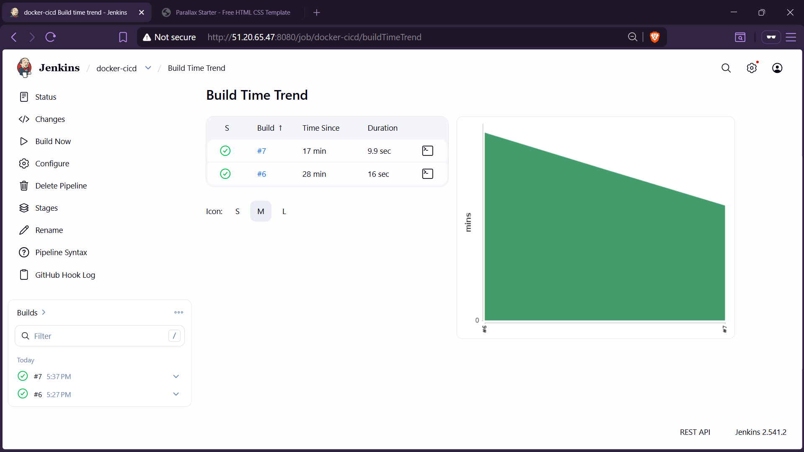
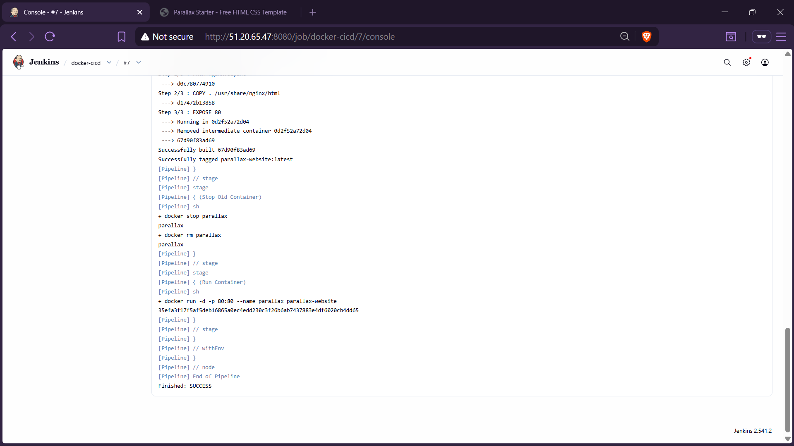
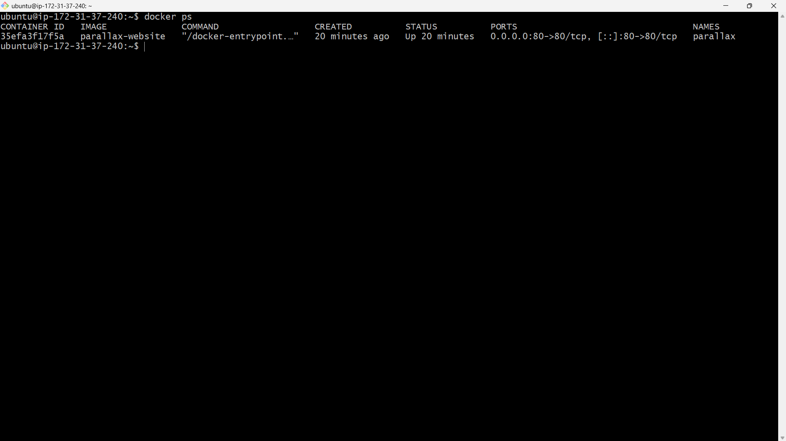
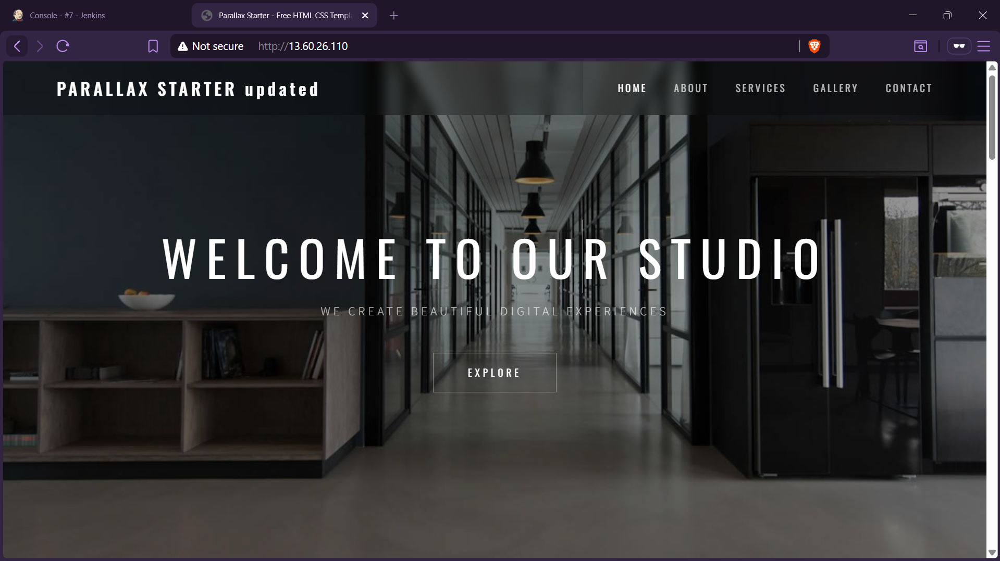

# 🚀 Jenkins CI/CD Pipeline for Static Website Deployment using Docker


> A complete **CI/CD pipeline** using Jenkins and Docker on separate servers that automatically builds and deploys a static website inside an Nginx Docker container on every GitHub push.

---

## 📸 Screenshots

### Jenkins Pipeline View
> _Add your Jenkins pipeline screenshot here_
/


### Pipeline Stages Running
> _Add your pipeline stages screenshot here_



### Docker Container Running
> _Add your docker ps output screenshot here_



### Live Website
> _Add your deployed website screenshot here_



---

## 🏗️ Architecture

```
Developer (Local Machine)
        │
        │  git push
        ▼
┌─────────────────────┐
│   GitHub Repository  │
│  (Source of Truth)   │
└─────────┬───────────┘
          │
          │  Webhook / Poll SCM
          ▼
┌─────────────────────┐
│   Jenkins Server     │
│   (51.20.65.47)      │
│                      │
│  ┌────────────────┐  │
│  │ Jenkins Agent  │  │
│  │ (SSH Connected)│  │
│  └────────────────┘  │
└─────────┬───────────┘
          │
          │  SSH → Build & Deploy
          ▼
┌─────────────────────┐
│   Docker Server      │
│   (13.60.26.110)     │
│                      │
│  ┌────────────────┐  │
│  │ Docker Engine  │  │
│  │                │  │
│  │  ┌──────────┐  │  │
│  │  │  Nginx   │  │  │
│  │  │Container │  │  │
│  │  │  :80     │  │  │
│  │  └──────────┘  │  │
│  └────────────────┘  │
└─────────┬───────────┘
          │
          │  HTTP :80
          ▼
┌─────────────────────┐
│    Static Website    │
│  (Publicly Accessible)│
└─────────────────────┘
```

---

## 🛠️ Technologies Used

| Technology | Purpose |
|-----------|---------|
| **Jenkins** | CI/CD Pipeline Orchestration |
| **Docker** | Containerization & Deployment |
| **Nginx** | Web Server (inside container) |
| **GitHub** | Source Code Repository |
| **Ubuntu EC2** | Cloud Server Infrastructure |

---

## 🖥️ Server Configuration

| Server | Purpose | IP Address | Port |
|--------|---------|-----------|------|
| Jenkins Server | CI/CD Pipeline | `51.20.65.47` | `8080` |
| Docker Server | Build & Run Containers | `13.60.26.110` | `80` |

---

## 📁 Project Structure

```
jenkis-cicd-docker/
│
├── 📄 index.html                        # Main HTML file
├── 🎨 templatemo-parallax-starter.css   # Stylesheet
├── ⚙️  templatemo-parallax-script.js    # JavaScript
├── 🖼️  images/                           # Image assets
│   └── ...
├── 🐳 Dockerfile                        # Docker build instructions
└── 📋 Jenkinsfile                       # Jenkins pipeline definition
```

---

## 🐳 Dockerfile

The Dockerfile builds a container to serve the static website using the lightweight Nginx Alpine image.

```dockerfile
FROM nginx:alpine

COPY . /usr/share/nginx/html

EXPOSE 80
```

---

## 📋 Jenkinsfile (Pipeline)

The pipeline runs on the remote Docker agent and performs 5 key stages:

```groovy
pipeline {
    agent { label 'docker' }

    stages {

        stage('Install Docker') {
            steps {
                sh '''
                if ! command -v docker &> /dev/null
                then
                    sudo apt update
                    sudo apt install docker.io -y
                    sudo systemctl start docker
                    sudo systemctl enable docker
                fi
                '''
            }
        }

        stage('Verify Docker') {
            steps {
                sh 'docker --version'
            }
        }

        stage('Build Docker Image') {
            steps {
                sh 'docker build -t parallax-website .'
            }
        }

        stage('Stop Old Container') {
            steps {
                sh '''
                docker stop parallax || true
                docker rm parallax || true
                '''
            }
        }

        stage('Run Container') {
            steps {
                sh '''
                docker run -d -p 80:80 --name parallax parallax-website
                '''
            }
        }

    }
}
```

### Pipeline Stages Explained

| # | Stage | Description |
|---|-------|-------------|
| 1 | **Install Docker** | Checks if Docker is installed; installs it if not |
| 2 | **Verify Docker** | Confirms Docker is running and prints version |
| 3 | **Build Docker Image** | Builds the `parallax-website` image from Dockerfile |
| 4 | **Stop Old Container** | Gracefully stops and removes the previous container |
| 5 | **Run Container** | Launches a new container on port 80 |

---

## ⚙️ Setup Guide

### Step 1 — Install Jenkins Server

SSH into your Jenkins EC2 instance and run:

```bash
# Update packages
sudo apt update

# Install Java (Jenkins dependency)
sudo apt install openjdk-17-jdk -y

# Install Jenkins
sudo wget -O /usr/share/keyrings/jenkins-keyring.asc \
  https://pkg.jenkins.io/debian-stable/jenkins.io-2023.key

echo "deb [signed-by=/usr/share/keyrings/jenkins-keyring.asc]" \
  https://pkg.jenkins.io/debian-stable binary/ | sudo tee \
  /etc/apt/sources.list.d/jenkins.list > /dev/null

sudo apt update
sudo apt install jenkins -y

# Start and enable Jenkins
sudo systemctl start jenkins
sudo systemctl enable jenkins
```

> Access Jenkins at: `http://51.20.65.47:8080`

---

### Step 2 — Setup Docker Server

SSH into your Docker EC2 instance and run:

```bash
# Install Docker
sudo apt update
sudo apt install docker.io -y

# Start and enable Docker
sudo systemctl start docker
sudo systemctl enable docker

# Add ubuntu user to docker group (avoids sudo requirement)
sudo usermod -aG docker ubuntu

# Apply group changes (or logout and login again)
newgrp docker
```

---

### Step 3 — Configure Jenkins Agent (Docker Node)

In Jenkins UI, navigate to:

```
Manage Jenkins → Nodes → New Node
```

Configure the node with:

```
Name:             docker-node
Type:             Permanent Agent
Remote Directory: /home/ubuntu/jenkins
Labels:           docker
Launch Method:    Launch agents via SSH
Host:             13.60.26.110
Credentials:      ubuntu (SSH private key)
Host Key:         Non-verifying Strategy
```

> Make sure Jenkins has the **SSH Agent Plugin** installed.

---

### Step 4 — Create Jenkins Pipeline Job

In Jenkins UI:

```
New Item → Pipeline → OK
```

Configure the pipeline:

```
Definition:     Pipeline script from SCM
SCM:            Git
Repository URL: https://github.com/tushdarek/jenkis-cicd-docker.git
Branch:         */main
Script Path:    Jenkinsfile
```

---

## ▶️ Run the Pipeline

Click **"Build Now"** in your Jenkins pipeline job.

You should see all 5 stages turn green ✅

---

## 🌐 Access the Website

Once the pipeline completes successfully, open your browser and visit:

```
http://13.60.26.110
```

The static parallax website will be live inside the Docker container! 🎉

---

## 🔄 CI/CD Workflow

```
Developer pushes code to GitHub
        │
        ▼
Jenkins detects the change (Poll SCM / Webhook)
        │
        ▼
Jenkins triggers the pipeline on Docker Agent
        │
        ▼
Docker image is built from Dockerfile
        │
        ▼
Old container is stopped and removed
        │
        ▼
New container is launched on port 80
        │
        ▼
Website is live and updated ✅
```

---

## 🔧 Troubleshooting

| Problem | Solution |
|---------|----------|
| Jenkins agent not connecting | Check SSH key permissions (`chmod 600 ~/.ssh/id_rsa`) |
| Docker permission denied | Run `sudo usermod -aG docker ubuntu` and re-login |
| Port 80 already in use | Run `docker stop parallax && docker rm parallax` |
| Container not starting | Check logs: `docker logs parallax` |
| Build failing at image step | Ensure Dockerfile exists at repo root |

---

## 🚀 Future Improvements

- [ ] Add **GitHub Webhooks** for instant pipeline triggers (instead of polling)
- [ ] Integrate **SonarQube** for code quality analysis
- [ ] Push Docker images to **DockerHub** with versioned tags
- [ ] Deploy to **Kubernetes** cluster for high availability
- [ ] Add **Slack/Email notifications** on build success/failure
- [ ] Implement **multi-stage Docker builds** to reduce image size
- [ ] Add **automated testing** stage before deployment

---

## 📝 How to Add Screenshots

1. Create a `screenshots/` folder in your repository
2. Take screenshots of:
   - Jenkins Dashboard showing the pipeline
   - Pipeline build stages (all green)
   - Docker container running (`docker ps` output)
   - The live website in the browser
3. Save them as:
   - `screenshots/jenkins-pipeline.png`
   - `screenshots/pipeline-stages.png`
   - `screenshots/docker-running.png`
   - `screenshots/website-live.png`
4. Push to GitHub — they will auto-display in this README

---

## 👨‍💻 Author

**Tushar Darekar**


